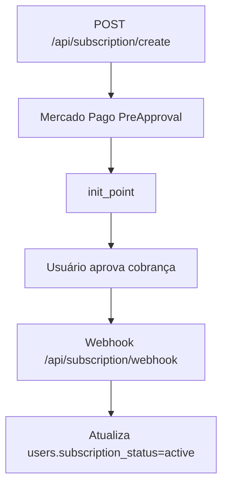

```mermaid
flowchart TD
  A[POST /api/subscription/create] --> B[Mercado Pago PreApproval]
  B --> C[init_point]
  C --> D[Usuário aprova cobrança]
  D --> E[Webhook /api/subscription/webhook]
  E --> F[Atualiza users.subscription_status=active]
```

